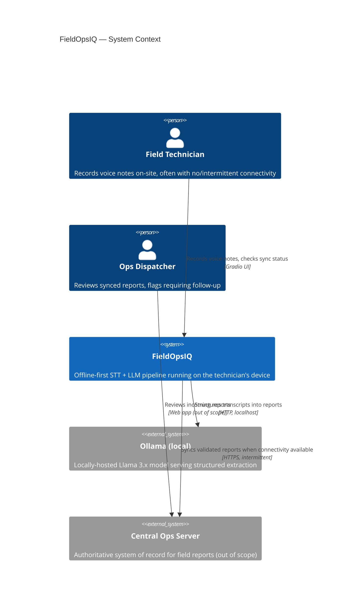
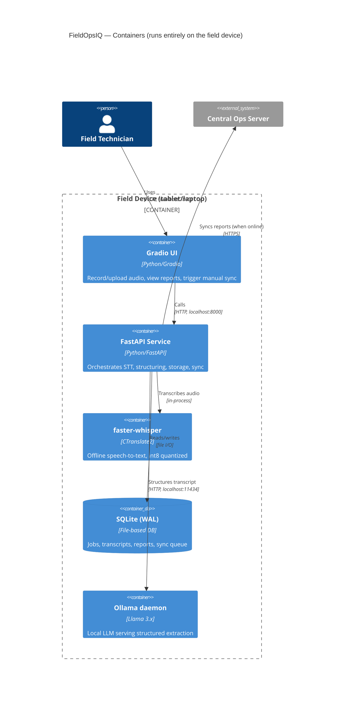
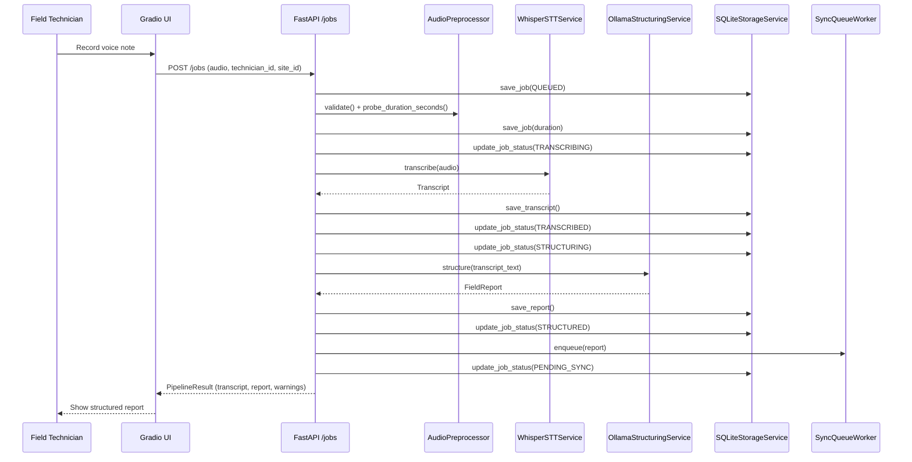
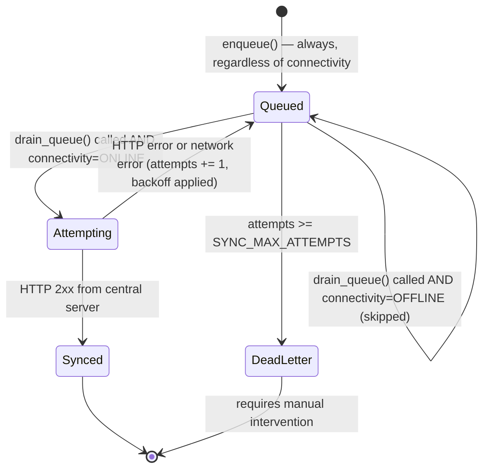
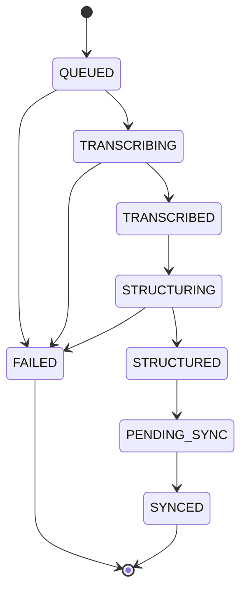

# Architecture Diagrams

## C4 Level 1 — System Context

```mermaid
C4Context
    title FieldOpsIQ — System Context

    Person(tech, "Field Technician", "Records voice notes on-site, often with no/intermittent connectivity")
    Person(dispatcher, "Ops Dispatcher", "Reviews synced reports, flags requiring follow-up")

    System(fieldopsiq, "FieldOpsIQ", "Offline-first STT + LLM pipeline running on the technician's device")

    System_Ext(ollama, "Ollama (local)", "Locally-hosted Llama 3.x model serving structured extraction")
    System_Ext(central, "Central Ops Server", "Authoritative system of record for field reports (out of scope)")

    Rel(tech, fieldopsiq, "Records voice notes, checks sync status", "Gradio UI")
    Rel(fieldopsiq, ollama, "Structures transcripts into reports", "HTTP, localhost")
    Rel(fieldopsiq, central, "Syncs validated reports when connectivity available", "HTTPS, intermittent")
    Rel(dispatcher, central, "Reviews incoming reports", "Web app (out of scope)")
```

## C4 Level 2 — Containers

```mermaid
C4Container
    title FieldOpsIQ — Containers (runs entirely on the field device)

    Person(tech, "Field Technician")

    Container_Boundary(device, "Field Device (tablet/laptop)") {
        Container(ui, "Gradio UI", "Python/Gradio", "Record/upload audio, view reports, trigger manual sync")
        Container(api, "FastAPI Service", "Python/FastAPI", "Orchestrates STT, structuring, storage, sync")
        Container(stt, "faster-whisper", "CTranslate2", "Offline speech-to-text, int8 quantized")
        ContainerDb(sqlite, "SQLite (WAL)", "File-based DB", "Jobs, transcripts, reports, sync queue")
        Container(ollama_local, "Ollama daemon", "Llama 3.x", "Local LLM serving structured extraction")
    }

    System_Ext(central, "Central Ops Server")

    Rel(tech, ui, "Uses", "HTTP, localhost:7860")
    Rel(ui, api, "Calls", "HTTP, localhost:8000")
    Rel(api, stt, "Transcribes audio", "in-process")
    Rel(api, ollama_local, "Structures transcript", "HTTP, localhost:11434")
    Rel(api, sqlite, "Reads/writes", "file I/O")
    Rel(api, central, "Syncs reports (when online)", "HTTPS")
```

## Pipeline Sequence — Happy Path

```mermaid
sequenceDiagram
    participant Tech as Field Technician
    participant UI as Gradio UI
    participant API as FastAPI /jobs
    participant Pre as AudioPreprocessor
    participant STT as WhisperSTTService
    participant LLM as OllamaStructuringService
    participant DB as SQLiteStorageService
    participant Sync as SyncQueueWorker

    Tech->>UI: Record voice note
    UI->>API: POST /jobs (audio, technician_id, site_id)
    API->>DB: save_job(QUEUED)
    API->>Pre: validate() + probe_duration_seconds()
    API->>DB: save_job(duration)
    API->>DB: update_job_status(TRANSCRIBING)
    API->>STT: transcribe(audio)
    STT-->>API: Transcript
    API->>DB: save_transcript()
    API->>DB: update_job_status(TRANSCRIBED)
    API->>DB: update_job_status(STRUCTURING)
    API->>LLM: structure(transcript_text)
    LLM-->>API: FieldReport
    API->>DB: save_report()
    API->>DB: update_job_status(STRUCTURED)
    API->>Sync: enqueue(report)
    API->>DB: update_job_status(PENDING_SYNC)
    API-->>UI: PipelineResult (transcript, report, warnings)
    UI-->>Tech: Show structured report
```

## Sync Queue State Machine

```mermaid
stateDiagram-v2
    [*] --> Queued: enqueue() — always, regardless of connectivity
    Queued --> Attempting: drain_queue() called AND connectivity=ONLINE
    Queued --> Queued: drain_queue() called AND connectivity=OFFLINE (skipped)
    Attempting --> Synced: HTTP 2xx from central server
    Attempting --> Queued: HTTP error or network error (attempts += 1, backoff applied)
    Queued --> DeadLetter: attempts >= SYNC_MAX_ATTEMPTS
    Synced --> [*]
    DeadLetter --> [*]: requires manual intervention
```

## Job Lifecycle (JobStatus)

```mermaid
stateDiagram-v2
    [*] --> QUEUED
    QUEUED --> TRANSCRIBING
    TRANSCRIBING --> TRANSCRIBED
    TRANSCRIBED --> STRUCTURING
    STRUCTURING --> STRUCTURED
    STRUCTURED --> PENDING_SYNC
    PENDING_SYNC --> SYNCED
    QUEUED --> FAILED
    TRANSCRIBING --> FAILED
    STRUCTURING --> FAILED
    FAILED --> [*]
    SYNCED --> [*]
```
